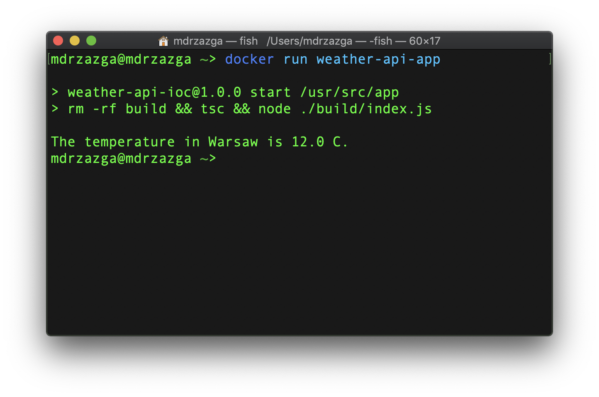

# Simple Weather API Consumer
A dockerized Node.js console app that consumes [OpenWeather API](https://openweathermap.org/api) and displays result in the terminal.



### Created with
* [TypeScript](https://www.typescriptlang.org/)
* [Docker](https://www.docker.com/)
* [InversifyJS](https://github.com/inversify/InversifyJS)
* [axios](https://github.com/axios/axios)

## Installation
### Setting up API key
1. Go to https://openweathermap.org/api, sign up and get your API key
2. Paste your API key in thr `url` variable on 19th line of `src/WeatherApi.ts`

## Running the app
### Running inside Docker container
1. Start Docker desktop app
2. Open Terminal, go to app's directory build the image with the command:
```
docker build -t weather-api-app .
```
3. Open terminal with whatever directory and run the command:
```
docker run weather-api-app
```
4. To run the unit tests run:
```
docker run weather-api-app /bin/bash && npm test
```

### Running directly on your machine
1. Open Terminal and go to app's directory
2. Install dependencies by running the command:
```
npm i
```
3. Start the up with command
```
npm start
```
4. Run the tests with command:
```
npm test
```